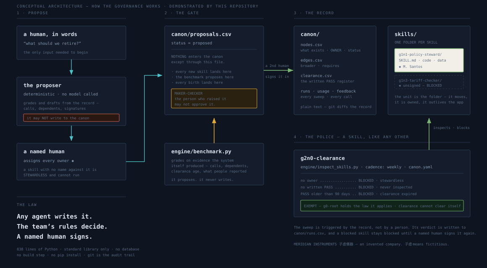
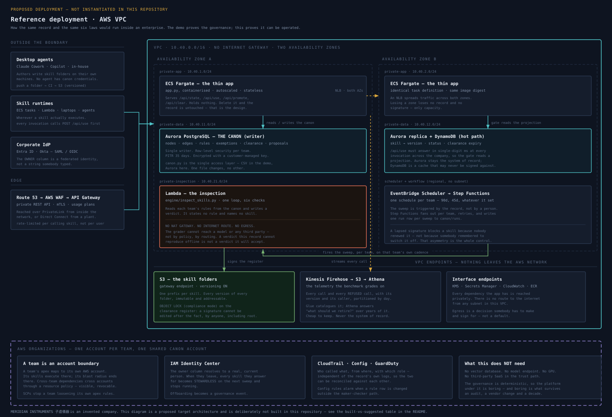

# Skills Canon

## Trust terminates at a person. Not at a process.

Language leaks — so we wrapped the model in a process and called it safe.

But an **agent process has a fuzzy trust line**. Many hands, many hops, a prompt someone edited, a
step nobody owns. When the output is wrong, there is no one standing at the end of it to hold.

And the ground just moved. We used to use skills to build agents; now we **use agents to build
skills** — capability arriving faster than anyone can inventory it, every piece of it carrying the
same fuzzy line behind it.

## An open standard is not enough

It helps. It is not enough. **A `SKILL.md` says what a skill *looks like*. It says nothing about
whether the skill may run here.** Four things are missing, and every one of them is enterprise
business, not format business:

| what an open standard leaves out | what this record supplies |
|---|---|
| **the metadata that matters to *your* enterprise, enforced** | Which fields matter is your decision, not a standard's. Declare them as **signed rules** — `card_has`, `card_is`, `card_max` — and every sweep checks them. One graph demands `max-tokens`; another demands `security-review`. Neither is in any published format. |
| **a graph — dependencies and inspection rights** | `requires` and `inspected by` are edges in the record, walked and enforced. Who may inspect whom is **declared**, not assumed; who depends on whom is a fact the sweep can act on, not a diagram. |
| **a hierarchy of identity and access** | `canon/grants.csv` — which principal, in which role, over which scope, may create, promote, sign or write. Granted by a named human. **Expiring.** Including across team boundaries, where skills cross-pollinate. |
| **a stable base to test against** | Every suite runs against **one pinned open-weights model**, named by weight hash in `canon.yaml` and served from anywhere OpenAI-compatible. Hold the base still and a moving pass rate means **the skill moved**. Test on a frontier model that changes underneath you and you can never say which one broke. |

### Why the base is pinned, and deliberately not the best model available

A test tells you something only if the thing underneath it holds still. Chase each new frontier
release and your pass rate moves for two reasons you cannot separate — your skill changed, or the
model did, silently, on somebody else's schedule.

So the base is one open-weights model at one quantisation, held still on purpose. It is not the
smartest model available. It is **the same one as last month**:

> **Reading the names.** Every skill has an address. `g1n2-quote-reader` is *graph 1, node 2*. `N0` is
> the master of its graph; `N1` upward are its members. **`G0` is the apex** — the one skill that has
> no graph above it, and the one a team begins with.

```console
$ python3 engine/testrun.py g1n2-quote-reader
g1n2-quote-reader  v2026-08.2  suite=quote-and-refuse  n=6
  base    qwen2.5-14b-instruct · Q4_K_M-sha256:4f1e9c2a  (offline-stub)
  result  100%  (0 failed)  floor 90%  → PASS
  moved   +2 pts against the same base — so the SKILL moved, not the model
```

Note `(offline-stub)`. With no `TEST_BASE_URL` set, no open-weights server actually answered, and the
harness says so, in the console and in the `runner` column of the row it writes. A result nobody can
attribute to a real base gets labelled as one, and `R-TEST-04` can block on exactly that. Point
`TEST_BASE_URL` at any OpenAI-compatible server — llama.cpp, vLLM, Ollama — and the same command
writes `runner=local-openweights` instead. The suites shipped here are abridged excerpts; the full
runs on record in `canon/tests.csv` are the `n=30 / 25 / 40 / 20` ones, signed by the humans who ran
them.

Moving the pin is a governed change like any other, and **a newer base is only worth adopting if it
strictly improves the suites already on record** — every suite, not the average. A model that is
better at nine skills and worse at one has not improved this estate; it has traded a known failure
for an unknown one.

### All four, on one skill

```console
✗ g1n3-legacy-fx-lookup    ◆ J. Varga   [17 rules applied]
    → CLEARANCE EXPIRED — 156d old, limit 90                       [R-CLEAR-02 · ◆ D. Halim]
    → max-tokens 32000 EXCEEDS THE LIMIT 8000 SET BY THIS GRAPH    [R-CTX-01   · ◆ M. Santos]
    → PASS RATE 71% BELOW THE 90% FLOOR (6 of 20 failed, −19 pts
      against the same base) — the base did not move, so the skill did  [R-TEST-02 · ◆ D. Halim]
    → TESTED AT v2026-03.6, THE RECORD HOLDS v2026-04.1 — the suite
      was never re-run after the change                            [R-TEST-03 · ◆ D. Halim]
```

Nobody switched that skill off. Its signature lapsed, its context ceiling was breached, and it
started failing against a base that had not moved. **Four independent rules, four named authors, one
verdict** — and the record reached it before a person had to notice.

## Where the line ends

**A skill is a folder. One folder, one owner.** The canon is the record over the folders —
**versioned, and policed by one another.** Rules are not code; they are signed rows, inherited from
an apex down. Every invocation registers before it runs, and the record is allowed to refuse.

Not a process. **A person, named in a row, who can be asked.**

> You don't get promoted. Your skill does.

---

## Run it

```bash
git clone https://github.com/liewhengleehenry/skills-canon && cd skills-canon
python3 app.py                                 # → http://localhost:8000
```

Python 3 standard library only. **No `pip install`, no database, no build step.**

```bash
python3 engine/inspect_skills.py               # the cadence sweep — every rule in the record
python3 engine/testrun.py g1n2-quote-reader    # the suite, against the pinned open-weights base
python3 engine/register.py <skill> <version>   # the registration gate, from outside
python3 engine/benchmark.py                    # graded on evidence; proposes, never writes
```

Live demo, nothing to install: **https://liewhengleehenry.github.io/skills-canon/**. It runs the
same rules in the browser over in-memory state. The served build writes to real CSVs and real
folders on disk; the browser build is there so you can look at it without cloning anything.

## How it works

A person commits a **G0**, and that act is the team. A G0 is the apex of a team's graph: a skill
folder like any other, with a version and a named owner, but the only one that sits above everything
else. It is administrative rather than functional — it does no work of its own. What it holds is the
rules its members will inherit and the name of the human who administers them, which is why
committing one is not a setup step but the act that brings the team into being. Anyone then writes skills in any agent, and
every skill is born under that team's rules plus any stricter rule its graph master added. Teams
link to teams: a cross-team dependency sees the version, the owner and the signature date before it
commits, and accountability stays with the producing team.

Some skills inspect the others, and none of that is hardcoded. `g2n0-clearance` is an ordinary
skill: a folder, a version, a named human, minted by the apex and promoted through the same
maker-checker queue. What makes it an inspector is that other skills declared an edge to it. Remove
the edge and it inspects nothing. In `canon.yaml` it is one line, `inspector:`, and you can point it
somewhere else.

`engine/inspect_skills.py` is a loop and twelve generic checks. It names no skill and states no
rule. Every rule it applies is a signed row, scoped and inherited:

| rule | scope | check | authored by | approved by |
|---|---|---|---|---|
| `R-CARD-04` | apex, inherited by every skill | `card_has skill-owner` | ◆ A. Chen | ◆ D. Halim |
| `R-TEST-02` | apex, inherited by every skill | `test_pass_min 0.90` | ◆ D. Halim | ◆ A. Chen |
| `R-IAM-01` | apex, inherited by every skill | `grant_write` | ◆ A. Chen | ◆ D. Halim |
| `R-CTX-01` | `g1n0-refund-master` only | `card_max max-tokens:8000` | ◆ M. Santos | ◆ A. Chen |

The last row is the one that matters. M. Santos owns that graph, and she set its context ceiling
herself: a graph owner may be stricter than the apex, never looser. Exemptions work the same way.
The apex and the inspector are exempt because of rows in `canon/exemptions.csv` naming who granted
the exemption and when it expires, not because of a line of code.

## Nothing runs unregistered

Every issued skill registers with the record before it does any work: thirty-five lines of standard
library in `engine/register.py`, or the same four fields over HTTP from any runtime in any language.
The record is allowed to say no.

```console
REGISTERED  g1n2-quote-reader        v2026-08.2
REFUSED     g1n2-quote-reader        v2026-07.9   VERSION MISMATCH — the canon holds 2026-08.2
REFUSED     g1n3-legacy-fx-lookup    v2026-04.1   CLEARANCE EXPIRED — 156d against a 90d limit
REFUSED     g9n9-shadow-tool         v1.0         UNREGISTERED — no such skill in the canon
```

All four lines, refusals included, are written to `canon/usage.csv` with their version and caller.
Shadow AI cannot run quietly here, because the attempt itself becomes evidence.

## The six laws

Three are enforced by code, because they are structural. Three by rows a named human signed,
because they are policy, and policy that lives in code is policy nobody can argue with.

| law | enforced by |
|---|---|
| Only a team's apex may create a skill in it. | code — `engine/birth.py` |
| Every creation lands `proposed`. | code — `canon/proposals.csv` |
| The maker may not check. | code — `POST /api/promote` |
| Nothing runs without a written PASS. | **row** — `R-CLEAR-01`, ◆ D. Halim |
| The grader proposes, never writes. | code — `engine/benchmark.py` |
| Nothing runs unregistered. | code — `POST /api/use` |

## System architecture

**Diagram 1, conceptual.** Built here. Every box maps to a file you can run.



**Diagram 2, a reference deployment on AWS.** Proposed, and deliberately not instantiated. Aurora
as the canon behind `canon.py`; S3 Object Lock on the clearance register so a signature cannot be
edited after the fact; DynamoDB as the read projection that keeps `/api/use` fast at agent call
volumes; an inspection subnet with no NAT gateway and no internet route, so the grader cannot reach
a model by routing rather than by policy; one AWS account per team.



### Built here, versus suggested

| | |
|---|---|
| **Built and runnable** | The record and its schema · the folder format and its card · apex-only creation · maker-checker promotion · the cadence sweep · clearance expiry · enterprise-specific metadata rules, scoped and inherited · the dependency and inspection-rights graph · a grant register for identity and access, scoped and expiring · a test harness against a pinned open-weights base · the registration gate · a benchmark computed from the system's own telemetry |
| **Suggested, not instantiated** | The identity provider behind the owner column · transport and auth on `/api/use` · the storage engine under `canon.py` · retention on `usage.csv` · the pipeline that publishes a folder to the agent runtimes · everything in Diagram 2 · the end state shown in the film, where machine customers transact into other systems of record, which the film argues for and this repository does not implement |

Standing up a VPC in three days would have proved less about the governance than the rules did.
`canon.py` is the single access layer, so swapping the storage engine is one file's worth of work.

## The record

```
canon.yaml            cadence · apex · inspector · the pinned test base
canon/
  nodes.csv           what exists · address · role · OWNER · version · status
  edges.csv           broader (hierarchy) · requires (dependency, enforced)
  rules.csv           every rule any inspection applies · scoped · authored · approved · versioned
  exemptions.csv      who is exempt, who granted it, when that must be reviewed
  grants.csv          identity and access · principal · role · scope · may · granted by · expires
  tests.csv           every suite run against the pinned base · pass rate · delta · weight hash
  clearance.csv       the written PASS register
  runs.csv            every sweep and its verdict
  usage.csv           every call and every refused call, with version and caller
  feedback.csv        what named people reported
  proposals.csv       the maker-checker queue. Nothing enters the canon except through here.
skills/               one folder per skill, each with tests/suite.jsonl
engine/               birth · inspect · testrun · register · benchmark · canon access
app.py                the thin app. Delete it and the record is untouched
docs/                 the console, and both architecture diagrams
```

Plain text on purpose: an owner who cannot open the record cannot be said to have signed it, and
`git log canon/clearance.csv` is the audit trail with no audit table to build or tamper with.

## Disclosure — existing code, models, data and third-party material

| what | disclosure |
|---|---|
| **prior method** | The governance pattern (apex-only creation, `proposed → active` promotion, one writer per record, inspection as a declared edge) was designed by the author before this event and carried in as a method. No code was carried in. |
| **code** | Every line here was written during BUILDMODE 2026 (4–6 September, Taipei Expo Dome). Nothing was copied from a prior project. |
| **models** | Generative AI writes the skills this system governs; that is the premise of the whole thing. The governance itself calls no model. `engine/testrun.py` calls an OpenAI-compatible endpoint only when `TEST_BASE_URL` points at a local open-weights server you run yourself. Without it a labelled stub runs and the row records `runner=offline-stub`. |
| **data** | All invented for this demonstration. |
| **third party** | Python 3 standard library only. The `SKILL.md` card format follows the open [Agent Skills](https://agentskills.io) standard. Web fonts (Archivo, IBM Plex Mono) via Google Fonts, SIL OFL. No other dependency, framework or asset. |

## Data provenance

MERIDIAN INSTRUMENTS 子虛儀器 is an invented company; 子虛 means *fictitious*. Every person, team,
rule and figure is constructed to demonstrate the mechanism, and no real organisation's data appears
anywhere in this repository. The submission film follows an invented author, Priya. The record here
shows the same mechanism with a different invented team. The names differ, the laws do not.

## Licence

MIT — see [LICENSE](LICENSE).
